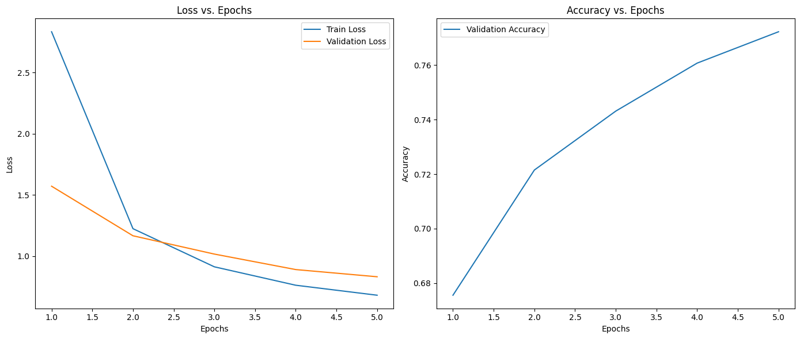
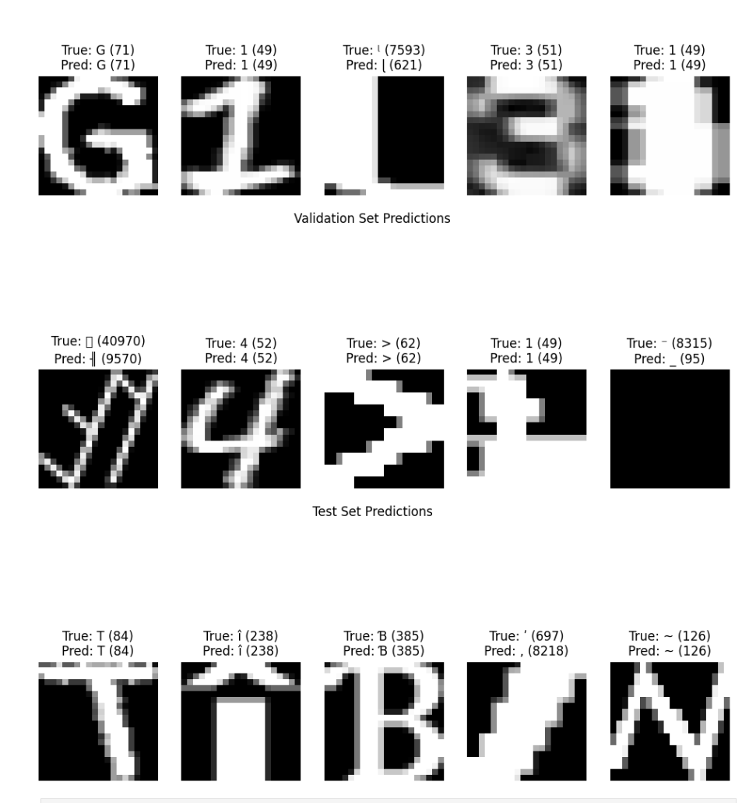
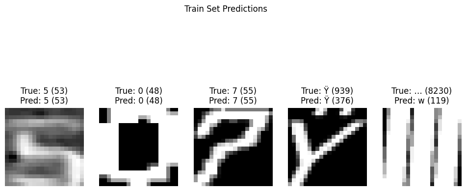
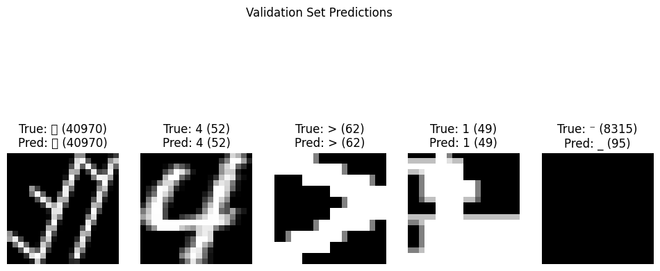

# CSE_151A_Project

## Milestone 2

### Dataset Details

The folder with the dataset is linked [here](https://drive.google.com/drive/folders/1YwGAiLkXr5lPY1PL1VM97KHVrMha24rm?usp=sharing).
The original dataset and its details can be found [here](https://archive.ics.uci.edu/dataset/417/character+font+images) via the UC Irvine Machine Learning Repository from Richard Lyman.

### [Data Exploration Jupyter Notebook](CSE_151_Project_Data_Exploration.ipynb)

### Data Preprocessing

#### I plan to...
- Scale the current image pixel values (currently 0-255) to 0-1, so the model can process the data better.
- Get rid of all the irrelevant features such as the font, fontVariant, strength, originalH, etc.
- Get rid of any missing data (although from my data exploration it seems are though there is no missing data).
- Split the data into a 80-10-10 train,test,validation split (respectively).
- Balance the fonts, so no one font is overrepresnted in the dataset.
- Subsample if the dataset is too large for the training step.
- Use binary encoding for the m_label class due to the large number of labels and the current ordinal numbers not being ideal.

## Milestone 3

#### [Data_Preprocessing Jupyter Notebook](Data_Preprocessing.ipynb)

### Major Preprocessing

I did the major preprocessing on the data by removing all of the columns except for the 400 pixel columns (features) and the m_label column (target) which represents the characters. I did not include the other features such as the font or the strength of the text which was in the original dataset because I thought it would add unnecessary complexity to the model for a baseline and would require modified CNN, but I might add them in future iterations of the model if I feel like it will help. I normalized the pixel values to make them range from 0 to 1 and did so by dividing by 255 (the max). I then split the data using train_test_split to split the data into 80% train and then I ran test_train_split again on the rest of the 20%, so I had an 80-10-10 train, validation, test split. I then converted these data splits to tensors, so I could store them in pt files which allows me to load up the preprocessed data without having to use pandas or spark everytime.

#### [Model and Training Notebook](Model_One.ipynb)

### Model

I opted to use a basic convolutional neural network to try to get a good baseline for a model. I used 3 convolutional layers with a max pooling layer after each to shrink the dimensions and a feedforward network with 3 layers. I decided to make the output of the convolution 128 feature maps on the last layer because there are 11475 unique classes (characters), so I thought it was a good place to start to extract the complexity. Also, I used a feedforward network with 3 layers as a baseline to try to extract the complexity as well. 

### Training

For training I loaded up the dataset and made the pixels into 20x20 tensors. I used an Adam optimizer with a learning rate of 0.001 because it is a good optimizer to start with for large datasets. For the loss I used crossentropyloss from the torch library. I used a batch size of 128 to try to speed up the training and 5 epochs because I just want a baseline on how the model train, but I did not want to train for 10 hours. The model ended taking about 3 hours to train.

### Evaluation

The accuracy on the test set after training was 76.95%. After the first epoch the accuracy on the validation set was 67.56%. At every epoch the loss went down by around 1-0.2, so I believe the model could improve more by just increasing the number of epochs (and potentially the learning rate). In the model fit graph below, the validation loss does not diverge from the train loss which indicates that the model is not really overfitting. Also, I evaluated the model on 5 images from each split (below) and it predicted the character accurrately for about 3/5 in each split, but the characters with less white used (smaller characters) seem to be the ones that were predicted wrong. The more common characters like number (i.e. 1) are predicted quite accurately.

### Conclusion

At the moment I do not think I will change the model's architecture, but I will just tweak the hyperparameters such as the number of epochs and the learning rate to see if I can minimize the loss even more and increase the accuracy. Based on the fit graph it seems to be learning well (without overfitting), but it just needs to train more to lessen the loss, so increasing those 2 parameters could help with that. In future iterations of the model I will consider more complex models like ResNets or adding features like the font to the feedforward network input, but right now I will stick with this model and just tweak the hyperparameters.

## Edit

After tuning the hyperparameters such as increasing the # of epochs and using a learning rate of 0.001 I was able to achieve an accuracy of 79.02% and a better fit. The updated fit graph is below and the updated code with these hyperparameters can be found here: [Model_One_Tuned.ipynb](Model_One_Tuned.ipynb)

## Milestone 4

#### [Model and Training Notebook](Model_Two.ipynb)

### Model

I implemented a ResNet to try to improve upon the CNN results from before by preventing any potential problems with a vanishing gradient. To do this I implemented a ResidualBlock class which represents a residual block that performs convolution with batch normalization and ReLU activation and adds the original input to the output of the convolution layer (skip connection). In the model as a whole, I used an initial convolutional layer with 2 subsequent residual blocks and max pooling layers. The first residual block increases the output channels from 32 to 64 and the second block increases it from 64 to 128. Next, the output is flattened and passed into a three layer fully connected network that outputs the character probabilities. I chose to use a ResNet and residual blocks because with the large number of unique classes (11,475 different characters) I thought using the residuals could add necessary complexity to the model that could improve the accuracy of the character predictions. In other words, the ResNet can learn deeper features which is needed due to the complex task of classifying 11,475 different characters.

### Training

For training, as before I loaded up the dataset and made the pixels into 20x20 tensors. I tried different combinations of hyperparameters, but ultimately got the best accuracy on the test data and fit (not overfitted or underfitted) after training multiple times. For loss, I used CrossEntropyLoss with label_smoothing set to 0.1 to prevent overfitting and make the model generalize better on unseen data. For optimization, I used Adam optimizer with a learning rate of 0.001 and a weight decay of 0.01 to prevent the train and validation loss to diverge and in turn to prevent overfitting. I also added a scheduler by using the pytorch StepLR with a step size of 2 and 0.5 which halves the learning rate every 2 epochs, so the the learning rate does not overshoot the optimal model. I used 10 epochs because that is where the model seemed to peak and a batch-size of 128 for a more efficient learning process. The model took around 20 minutes to train using an A100 GPU.

### Evaluation

The accuracy on the test set after training was 82.74% and 82.94% on the validation set. After the first epoch, the validation accuracy was 72.78% which is much higher than the accuracy of the CNN after the first epoch which was 67.26%, which means the ResNet learned better intially. After the initial drop of the test loss, the test loss and validation loss are near each other (with test loss being only a little lower) and drop steadily as the number of epochs increase. This indicates there is not a lot of overfitting and the model is fitting the data correctly and generalizing well. The trained model accurately predicted 4/5 character images (below) for the test and validation set and 3/5 character for the train set, which is also a sign of the model generalizing well. The model still has a problem with characters that are very similar which maybe improved with a more complex model albiet a more complex model may cause overfitting if not implemented correctly.

### Conclusion

Between the first and the second model there was almost a +4% increase in accuracy, so the ResNet is definitely an improvement over the CNN. The model still has minor issues with classifying characters that are very similar with others (a pixel or two different) or characters that are very niche and don't show up much in the dataset. To improve this, in my next model I think increasing the number of feature maps that the convolution and residual blocks generate would be beneficial to extract more features from the characters to handle these small characters. Also, I think potentially increasing the number of layers in the fully-connected network could potentially help the model learn more and classify the output better. All in all, I think increasing complexity in the form of adding more output channels, potentially adding more residual blocks (or convolutional layers), and layers in the fully-connected network could be an improvement over this model and could handle edgecases that are causing the accuracy to be lower than it should be.

#### Resources Used

- PyTorch Documentation (CNN class)
- ChatGPT
  - Prompts Used
    - "Give me different options for the structure and parameters of a CNN and tell me the pros and cons of each" (Used to decide on feature maps, number of convolutional layers, etc.)
    - "Give me a print statement that prints the loss and accuracy of the model at each epoc" (print statement in train)
    - "Give a function to evaluate the model at each step" (evalute function)
    - "Give me code that plots the loss and accuracy from a train and validation array that has these values stored for each epoc" (cell which contains the plotting code"
    - "Give me code that plots 5 each for valid, test, train for the ground truth and predictions if I have 20x20 images"
    - "How could I implement a residual block class for a ResNet in pytorch?"

