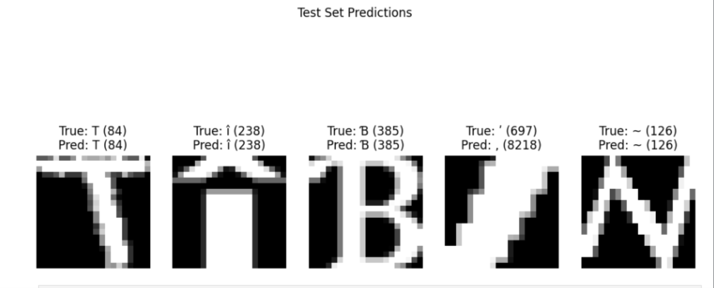

# Introduction 
The project centers on building a predictive model that can classify characters from images, where the dataset consists of 11,475 unique characters. This problem is interesting because it involves high-dimensional image data, making it an engaging challenge in the field of machine learning, particularly in computer vision. The ability to accurately predict and classify such a large number of characters has broad implications, from optical character recognition (OCR) systems to enhancing user experience in various applications like document scanning or automated text recognition.

Having a good predictive model for such tasks is important as it can improve the accuracy of automated systems in recognizing and processing text. Furthermore, it can aid in various practical applications, such as automated translation or reading aids for the visually impaired. In this project, we focus on achieving high accuracy in classifying images while also ensuring that the model generalizes well to unseen data.

# Methods

## Data Exploration

### Data Overview
- The folder with the dataset is linked [here](https://drive.google.com/drive/folders/1YwGAiLkXr5lPY1PL1VM97KHVrMha24rm?usp=sharing). The original dataset and its details can be found [here](https://archive.ics.uci.edu/dataset/417/character+font+images) via the UC Irvine Machine Learning Repository from Richard Lyman.
- **Data Concatenation**: The data from multiple CSV files was combined into a single DataFrame with 833,068 rows and 412 columns. A 40% sample of the data was then selected for analysis, resulting in 333,068 observations.
- **Columns**: The dataset includes various attributes such as `font`, `fontVariant`, `m_label`, `strength`, and pixel data (e.g., `r19c1` to `r19c19`).

### Key Statistics

- **Font Distribution**: The dataset contains 153 unique fonts, with the most frequent font being "OCRB" (37,346 occurrences).
- **Missing Data**: No missing data was found in the dataset, as indicated by `df.isnull().any(axis=1)` returning zero.
- **Class Labels**: There are 11,475 unique character labels, ranging from 0 to 65,533.

### Data Description

The dataset provides pixel values corresponding to 20x20 grayscale images of characters. The `m_label` column represents the class label, and each row includes information such as font style, size, and other features.

### Data Visualization

- **Pixel Visualization**: 15 random examples of the images were visualized by reshaping pixel data into 20x20 grids and displaying them using `matplotlib`. Each plot included the label, original height, and width of the character.

The notebook for data exploration can be found [here](CSE_151_Project_Data_Exploration.ipynb)

## Data Preprocessing

The data preprocessing was performed using a custom notebook that processes the `character+font+images.csv` dataset into PyTorch tensors. Key steps included:

- **Normalization**: Pixel values were scaled to the range [0, 1].
- **Dataset Splitting**: Data was divided into training (80%), validation (10%), and testing (10%) sets using `scikit-learn`'s `train_test_split`.
- **Serialization**: Preprocessed datasets were saved as `.pt` files for efficient loading during model training.

The notebook for data preprocessing can be found [here](Data_Preprocessing.ipynb). It uses the following libraries:

- `torch` for tensor operations and saving preprocessed datasets.
- `pandas` for reading the CSV data in chunks.
- `numpy` for array manipulation.
- `scikit-learn` for splitting datasets.

## Model Architectures

Three distinct convolutional neural network (CNN) architectures were implemented and evaluated.

### Model 1: Basic CNN

This model consists of:

- **Convolutional Layers**: Three convolutional layers with filter sizes of 32, 64, and 128 respectively, each followed by ReLU activation.
- **Pooling**: Max pooling layers (2x2) after each convolution to reduce spatial dimensions.
- **Fully Connected Layers**: Two fully connected layers with 512 and 256 neurons respectively.
- **Output Layer**: A final fully connected layer with neurons equal to the number of classes (for classification).

#### Hyperparameters:
- **Optimizer**: Adam optimizer with a learning rate of 0.001
- **Batch Size**: 128
- **Loss Function**: Cross-entropy loss

The architecture emphasizes simplicity while maintaining a focus on feature extraction and dimensionality reduction. The training notebook for this model is available [here](Model_One_Tuned.ipynb).

### Model 2: ResNet-inspired Architecture

Inspired by ResNet, this model includes:

- **Residual Blocks**: Two residual blocks, each containing two convolutional layers with 64 filters and a kernel size of 3x3.
- **Shortcut Connections**: Identity mapping for efficient feature learning and to mitigate the vanishing gradient problem.
- **Pooling**: A global average pooling layer before the fully connected layers.
- **Fully Connected Layers**: A single fully connected layer with 512 neurons for classification.

#### Hyperparameters:
- **Loss Function**: Cross-entropy loss with label smoothing (0.1)
- **Optimizer**: AdamW optimizer with a learning rate of 0.001, weight decay of 0.01
- **Scheduler**: StepLR with a step size of 2 and gamma of 0.5

The ResNet training notebook is accessible [here](Model_Two.ipynb).

### Model 3: Advanced ResNet

An extended ResNet architecture with additional residual blocks for deeper feature extraction was also implemented. This model features:

- **Residual Blocks**: Four residual blocks, each containing two convolutional layers with 64, 128, 256, and 512 filters respectively.
- **Shortcut Connections**: Identity mapping for each block to preserve gradient flow.
- **Pooling**: A global average pooling layer before the fully connected layers.
- **Fully Connected Layers**: Two fully connected layers with 512 and 256 neurons respectively for classification.

#### Hyperparameters:
- **Loss Function**: Cross-entropy loss with label smoothing (0.1)
- **Optimizer**: AdamW optimizer with a learning rate of 0.0005, weight decay of 0.01
- **Scheduler**: CosineAnnealingLR with `T_max=10` and `eta_min=0.0001`

This model’s training notebook can be found [here](Model_Three.ipynb).

### Training and Evaluation

All models were trained using the following setup:

- **Loss Function**: Cross-entropy loss for multi-class classification.
- **Batch Size**: A batch size of 128 was used to balance memory usage and training speed.
- **Metrics**: Accuracy was used to evaluate performance on validation and test datasets.

## Libraries Used

The following libraries were used across all notebooks:

- `torch` (PyTorch): Core library for building and training neural networks.
- `torch.nn.functional`: For activation functions and other utilities.
- `pandas` and `numpy`: For data loading and preprocessing.
- `matplotlib`: For visualizing sample data and results.
- `scikit-learn`: For splitting datasets.

The full implementation and exploration for each model can be reviewed in the provided notebooks linked above.

# Results

### Model 1: Basic CNN

#### Performance

- **Accuracy**: The basic CNN model achieved a test accuracy of **79.02%**, which was obtained after training for 10 epochs with a batch size of 128. The validation accuracy after the first epoch was **67.26%**. As the model trained further, the validation accuracy gradually improved.

- **Training Progress**: During training, the loss decreased steadily, with an approximate reduction of 1-0.2 per epoch. The validation loss did not diverge significantly from the training loss, indicating that the model was not overfitting.

- **Example Predictions**: The model correctly predicted **3 out of 5** test images for each split, with common characters such as numbers being predicted with high accuracy. Smaller characters or those with less white space in the images were more difficult for the model to predict correctly.

#### Visualizations

##### Training and Validation Loss vs Epochs
Below is the fit graph for the Basic CNN model, showing the training and validation loss over the epochs. The training and validation losses decreased steadily without significant divergence.

**Figure 1**: Training and Validation Loss for Basic CNN

##### Evaluation of Test Images
Example test images and the corresponding ground truth vs predictions for the Basic CNN model are shown below. These visuals highlight how the model performed in predicting different characters.

**Figure 4**: Basic CNN Predictions

---

### Model 2: ResNet-inspired Architecture

#### Performance

- **Accuracy**: The ResNet-inspired model achieved a test accuracy of **82.74%**, with a validation accuracy of **82.94%**. After the first epoch, the validation accuracy was **72.78%**, which was significantly higher than the CNN model’s first epoch accuracy of **67.26%**.

- **Training Progress**: The training and validation losses decreased steadily without significant divergence. The test and validation losses were almost identical, indicating the model was able to generalize well and was not overfitting.

- **Example Predictions**: The model correctly predicted **4 out of 5** test images for both the test and validation sets, while the training set saw **3 out of 5** correct predictions. As with the CNN, the model struggled with very similar characters or characters with fewer instances in the dataset.

#### Visualizations

##### Training and Validation Loss vs Epochs
Similar trends were observed, with the validation loss following the training loss closely, but with a slightly lower test loss.

**Figure 2**: Training and Validation Loss for ResNet-inspired Model

##### Evaluation of Test Images
Example test images and the corresponding ground truth vs predictions for the ResNet-inspired model are shown below.

**Figure 5**: ResNet-inspired Model Predictions

---

### Model 3: Advanced ResNet

#### Performance

- **Accuracy**: The advanced ResNet model, with additional residual blocks and deeper feature extraction, achieved a test accuracy of **84.33%** and a validation accuracy of **84.18%**.

- **Training Progress**: The training process for this model followed a similar trend to the ResNet-inspired model, with the test and validation losses decreasing steadily without divergence, signaling a well-balanced model that avoided overfitting.

- **Example Predictions**: The advanced ResNet model demonstrated improved accuracy on the more challenging cases, with a higher proportion of correct predictions for characters that are similar or underrepresented.

#### Visualizations

##### Training and Validation Loss vs Epochs

**Figure 3**: Training and Validation Loss for Advanced ResNet Model

##### Evaluation of Test Images
Example test images and the corresponding ground truth vs predictions for the ResNet-inspired model are shown below.

**Figure 6**: ResNet-inspired Model Predictions

---

### Summary of Results

The models were evaluated on the test set and achieved the following accuracies:

- **Basic CNN**: 79.02%  
- **ResNet-inspired Model**: 82.74%  
- **Advanced ResNet**: 84.33%

# Discussion

The results of this project highlight the strengths and limitations of different convolutional neural network (CNN) architectures in addressing the challenging task of multi-class character classification from high-dimensional image data. Each model demonstrated varying levels of performance, offering insights into the trade-offs between model complexity, accuracy, and generalization.

## Key Findings

### Model 1: Basic CNN

The basic CNN achieved a test accuracy of **79.02%**, providing a strong baseline. The steady decline in training and validation losses over the epochs suggests effective learning without overfitting. However, its relatively lower accuracy compared to more advanced architectures indicates that it struggled to capture the complex patterns required for distinguishing between **11,475 unique character labels**. This performance gap emphasizes the limitations of simpler architectures when applied to tasks involving such high-dimensional data and large class counts.

### Model 2: ResNet-inspired Architecture

The ResNet-inspired model showed marked improvement, achieving a test accuracy of **82.74%**. The use of residual connections likely mitigated the vanishing gradient problem, enabling the model to learn deeper features. Additionally, the near-identical training and validation losses suggest good generalization to unseen data. This architecture balanced complexity and performance effectively, making it a strong candidate for applications requiring moderate computational efficiency without sacrificing accuracy.

### Model 3: Advanced ResNet

The advanced ResNet model achieved the highest test accuracy of **84.33%**, confirming the benefits of deeper architectures for extracting complex features. However, the marginal improvement over the ResNet-inspired model raises questions about diminishing returns with increased depth. This model's slightly higher computational requirements may not justify its performance gain in all scenarios, particularly for real-time or resource-constrained applications.

## Implications

The progressive improvement in accuracy across models underscores the importance of architecture design in high-dimensional classification tasks. With every added complexity, the models demonstrated better performance, culminating in **84.33% accuracy** with the Advanced ResNet. However, even this relatively high accuracy reflects the inherent difficulty of the task due to the large number of classes. 

Furthermore, the subtle differences between **extremely similar characters**, as shown in the figures, often led to misclassifications where one character was predicted as another. While this might seem problematic, it reflects the fine-grained nature of the task rather than fundamental model limitations, as such errors often occur even for human observers.

While deeper and more sophisticated architectures generally offer better performance, their increased complexity necessitates careful consideration of computational resources and potential overfitting. For practical deployment, the choice of model should align with the specific constraints and requirements of the application, such as latency, hardware availability, and the tolerance for classification errors.

The challenges faced by all models in predicting underrepresented classes highlight the need for techniques like **data augmentation** or **class balancing** during preprocessing. Addressing these imbalances could further enhance the models’ ability to generalize to rare character labels.

## Limitations and Future Directions

1. **Dataset Representation:** Despite preprocessing efforts, the dataset’s inherent class imbalance likely influenced the models’ performance. Future work could explore advanced augmentation strategies or synthetic data generation to address this issue.

2. **Evaluation Metrics:** Accuracy alone may not fully capture the nuances of model performance, especially for highly imbalanced datasets. Incorporating metrics like F1-score, precision, and recall for individual classes could provide deeper insights into model strengths and weaknesses.

3. **Architectural Exploration:** While the ResNet architectures performed well, other advanced architectures such as **EfficientNet** or **Transformer-based models** could be explored to push the boundaries of accuracy and efficiency further.

4. **Hyperparameter Optimization:** A more exhaustive search for optimal hyperparameters, potentially using techniques like **Bayesian optimization**, could lead to further performance improvements.

5. **Real-world Testing:** Deploying the models in practical applications, such as OCR systems, would provide valuable feedback on their robustness and usability.

# Conclusion

In conclusion, this project demonstrated the effectiveness of different convolutional neural network (CNN) architectures in classifying characters from images, with the goal of handling a high-dimensional dataset of 11,475 unique labels. The models varied in complexity, from the basic CNN to the more advanced ResNet architectures, and each demonstrated significant performance improvements as the network depth increased. The basic CNN model set a solid baseline, while the ResNet-inspired and advanced ResNet models delivered higher accuracies, with the advanced ResNet achieving the highest test accuracy of 84.33%.

The results underline the importance of leveraging deeper architectures, such as ResNet, to effectively tackle complex image classification tasks. While the advanced ResNet model provided the best performance, the trade-off between accuracy and computational efficiency must be considered, especially for applications with real-time constraints. Future work can explore additional optimizations, such as hyperparameter tuning and exploring more advanced architectures like DenseNet or EfficientNet, to further improve accuracy and model efficiency.

Ultimately, the insights gained from this project contribute to the development of more accurate and efficient image classification models, with potential applications in optical character recognition (OCR), automated translation, and accessibility tools for the visually impaired. The success of the ResNet architectures in this task demonstrates their potential for scaling to more complex datasets and tasks in computer vision.

# Statement of Collaboration

Name: Salman Navroz
Title: Leader
Contribution: I did this project on my own (solo group), so I did all the work for this project.

## Resources used

- PyTorch Documentation
- Pandas Documentation
- Scikit-learn Documentation
- Numpy Documentation
- Matplotlib Documentation
- I used ChatGPT to assist in creating the visuals for this project such as the fit graph and the ground truth vs prediction images. It also assisted in writing this report,converting my writing to markdown, and making it better structured and professional grammar wise.
- Lyman, Richard. "Character Font Images." UC Irvine Machine Learning Repository. https://archive.ics.uci.edu/dataset/417/character+font+images.
- Shdangwal. "A ResNet Architecture Model Diagram." Medium. https://medium.com/@shdangwal/a-brief-and-simple-introduction-to-resnet-47432eff95b8.
- InterviewBit. https://www.interviewbit.com/blog/cnn-architecture/

